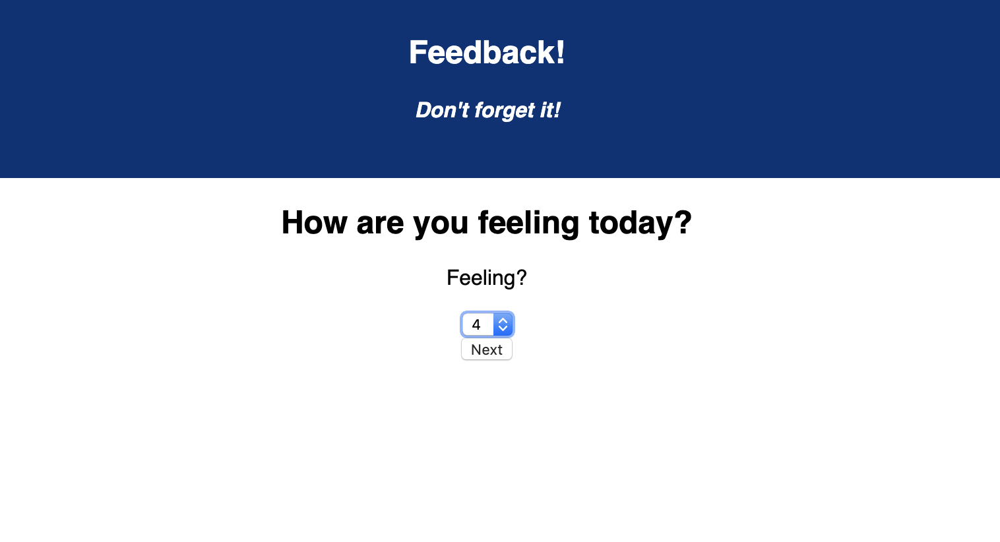
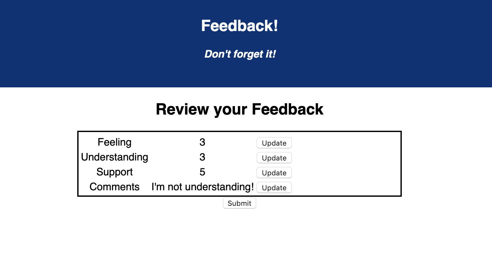

# Redux Feedback Loop

## Description

This React application creates a feedback form which allows teachers to understand how students are feeling about the material. The feedback will be collected over 4 views. As a user goes through the form, they will have the option to go back to a previous question and update their answer. In a separate Review page, students will be able to confirm their entries before submitting it to the database. After they have submitted their feedback, they have the option to leave new feedback.

## Prerequisites
- Node.js

## Screen Shot

## Getting Started
- npm install
- npm run server
- npm run client

## Usage
1. User begins on the first question of the survey where they will rate how they are feeling from 1-5 (5 being the best). The user will submit their answer then press "Next" to move onto the next question. The user must select an answer to this question before moving on. They will get an alert if they do not choose a rating.
2. The user will be taken to a new view where they are asked about their understanding of the material. This question also requires a response. The user has the option to submit their answer to this question by clicking "Next" or they may redo their previous response by clicking "Back".
3. The user will be taken to a third view asking them about how supported they feel. They can again submit their answer and move forward by clicking "Next" or they may go to the previous page by clicking "Back". As with the previous two questions, the user is required to respond to this question.
4. The fourth view will be the final question which asks the user for any comments. This is not required for the user to move forward. They can proceed by clicking "Next" or go back by clicking "Back".
5. Once the user clicks "Next", they will be taken to a new view which is a Review page. This page displays all of the user's responses. The user may click "Update" next to an answer they would like to change and this will take them back to the corresponding view. If they are happy with their responses, they may simply click "Submit" and their answers will be stored in the database.
6. The final view after the user clicks "Submit" thanks the user for their feedback and allows them to leave new feedback by clicking the button.

## Built With
- React
- Redux
- Axios
- JavaScript
- Node.js

## Acknowledgement
Thank you to Prime Digital Academy for equipping me with the knowledge and tools to create this application.
